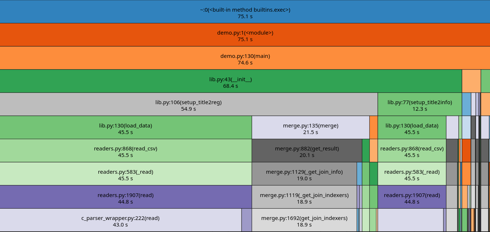

# Cinematic impact

Creating a virtual environment:

```
python -m venv venv
source venv/bin/activate
```

Installing the package from the repository using:
```
pip install -r .
```

Testing style by pylint:
```
pip install pylint
pylint src/cinematic_impact_package
```
Current score: ```10```

Example of launching demonstration program:
```
python3 src/cinematic_impact_package/demo.py --basics basics_path --ratings ratings_path --akas akas_path --gdp gdp_path --pop pop_path --pc pc_path --countries "Poland" "Germany" --genres "Comedy"
```
```
options:
  -h, --help            show this help message and exit
  --basics BASICS       Path to the TSV file including cols = ['tconst', 'genres', 'titleType', 'startYear'].
  --ratings RATINGS     Path to the TSV file including cols = ['tconst', 'numVotes', 'averageRating].
  --akas AKAS           Path to the TSV file including cols = ['titleId','title','region','isOriginalTitle'].
  --gdp GDP             Path to the CSV file with GDP data.
  --pop POP             Path to the CSV file with population data.
  --pc PC               Path to the CSV file with GDP per capita data.
  --countries COUNTRIES [COUNTRIES ...]
                        List of countries to compare.
  --genres {Romance,Documentary,News,Sport,Action,Adventure,Biography,Drama,Fantasy,Comedy,War,Crime,Family,History,Sci-Fi,Thriller,Western,Mystery,Horror,Music,Animation,Musical,Film-Noir,Adult,Reality-TV,Game-Show,Talk-Show} [{Romance,Documentary,News,Sport,Action,Adventure,Biography,Drama,Fantasy,Comedy,War,Crime,Family,History,Sci-Fi,Thriller,Western,Mystery,Horror,Music,Animation,Musical,Film-Noir,Adult,Reality-TV,Game-Show,Talk-Show} ...]
                        List of genres to compare.
  --prodtype {short,movie,tvShort,tvMovie,tvSeries,tvEpisode,tvMiniSeries,tvSpecial,video,videoGame,tvPilot}
                        The type of titles to filter (e.g., 'movie', 'tvEpisode', 'short', 'videoGame').
  --start START         The start year of the range to filter.
  --end END             The end year of the range to filter.
  --qm {sum_votes,mean,weighted_mean,flop_prob,masterpiece_prob,two-sided}
                        Quality measure
  --votetreshold VOTETRESHOLD
                        Minimum number of votes required for a movie to be included.

```

Profiling:

```
python3 -m cProfile -o out/demo.pts src/cinematic_impact_package/demo.py ...
```
```
echo "sort tottime\nstats\nquit" | python -m pstats out/demo.pts > pstats_output.txt
```
```
snakeviz demo.pts
```


Launching tests with pytest:

```
pytest --cov=cinematic_impact_package.lib
```
```
collected 22 items                                                                                                                                                                                                                         

tests/aux_test.py ...                                                                                                                                                                                                                [ 13%]
tests/lib_test.py ...................                                                                                                                                                                                                [100%]

---------- coverage: platform linux, python 3.11.6-final-0 -----------
Name                                  Stmts   Miss  Cover
---------------------------------------------------------
src/cinematic_impact_package/lib.py     173      6    97%
---------------------------------------------------------
TOTAL                                   173      6    97%


```
Data on which structure and analysis were based:

https://datasets.imdbws.com/

https://data.worldbank.org/indicator/NY.GDP.MKTP.CD?skipRedirection=true

https://data.worldbank.org/indicator/NY.GDP.PCAP.CD?skipRedirection=true

https://data.worldbank.org/indicator/SP.POP.TOTL?skipRedirection=true


Additional info about data sets:

Data sets from https://datasets.imdbws.com/ include countries marked in **pycountry** as histrorical (we marked it with *) and some which are undefined (we marked it with **).

To use the geopolitical data from https://data.worldbank.org/ to the analysis we take most recent available data of each country.